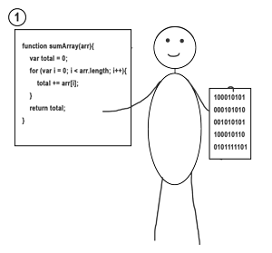

# Устройство движков JS

Так как в этом курсе будет рассматриваться работа JavaScript в браузере, сначала необходимо разобраться как JavaScript в нём выполняется.

Когда мы разрабатываем программу, мы хотим, чтобы компьютер, а в нашем случае браузер, её выполнил. Но сложность в том, что компьютер понимает только машинный код, и чтобы выполнились наши команды сначала их нужно перевести на понятный компьютеру язык. Программы, которые переводят и выполняют код, написанный на JavaScript, называются JavaScript-движками.

Вообще в программировании для этих целей существует два основных подхода, это использовать интерпретатор или компилятор.

## Интерпретатор

Интерпретатор, это программа, реализующая _построчный_ анализ, обработку и выполнение исходного кода программы.

Простой интерпретатор анализирует и тут же выполняет программу построчно (покомандно), по мере поступления её исходного кода. Достоинством такого подхода является мгновенная реакция на команды. Именно поэтому браузеры сначала использовали интерпретаторы JavaScript. Ведь очень важно, чтобы код запускался и работал быстро. Недостаток в том, что интерпретатору приходится проделывать одну и ту же работу, когда вы используете одинаковый код несколько раз. Например, если вы находитесь в цикле, интерпретатор будет анализировать одни и те же строки снова и снова. То есть при таком построчном анализе отсутствует оптимизация и происходит излишняя работа. Также такой интерпретатор обнаруживает ошибки в коде только при попытке выполнения строки с ошибкой. И никак не сможет сообщить об ошибке в коде с самого начала.

## Компилятор

Компилятор с другой стороны не выполняет программу построчно, сначала он последовательно анализирует и разбирает код программы, производит необходимую оптимизацию и только после этого генерирует машинный код, который впоследствии начнет выполняться.

Поэтому при компиляции требуется больше времени для запуска, так как в начале должны пройти все её этапы. Но при этом компилятор оптимизирует код для увеличения скорости его работы. Например циклы будут работать быстрее, потому что после оптимизации нет необходимости повторять одни и те же действия анализа кода для каждого прохода через цикл. Также компилятор сразу может сообщить, что в коде присутствует ошибка.

## Динамическая компиляция

Для того, чтобы взять самое лучшее из этих двух подходов, браузеры начали их совмещать. Хотя различные браузеры делают это немного по разному, но суть этой идеи одна - использование динамической компиляции (на английском _Just-in-time compilation_, JIT-компиляция).

В движок JavaScript был добавлен инструмент, называемый профилировщиком, который сообщает системе о том, в каких методах программа тратит больше всего времени, чтобы в дальнейшем их можно было оптимизировать.

При первом выполнении JS-кода он полностью прогоняется через компилятор, который сразу, без каких-либо дополнительных оптимизаций преобразовывает его в машинный код. Это позволяет очень быстро приступить к его выполнению или сообщить об ошибках в нашем коде на начальной стадии. (Сейчас в современных движках уже не применяют интерпретаторы, для построчного анализа и выполнения кода, даже при самом первом запуске JS-программы).

После того, как код какое-то время поработает, профилировщик соберёт достаточно данных для того, чтобы система могла понять, какие методы нужно оптимизировать. Например, когда одна и та же функция выполняется несколько раз, компиляции берет её отдельно в работу. Где она оптимизируется и сохраняется в новом виде. При следующем обращении к этой функции вызовется уже её оптимизированная версия, тем самым ускорив процесс её выполнения.
